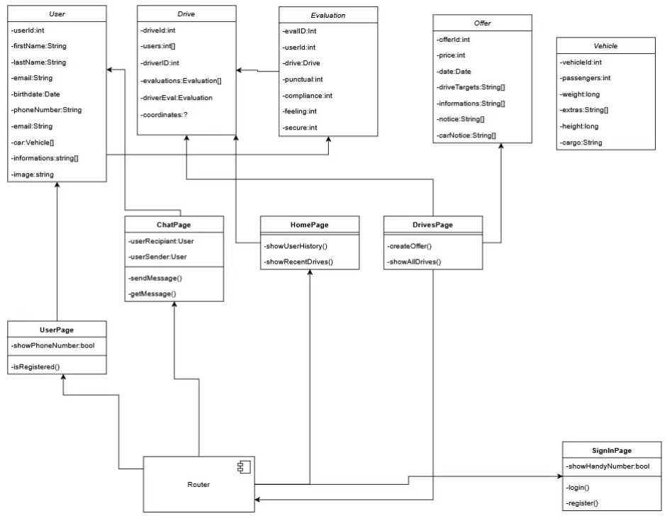
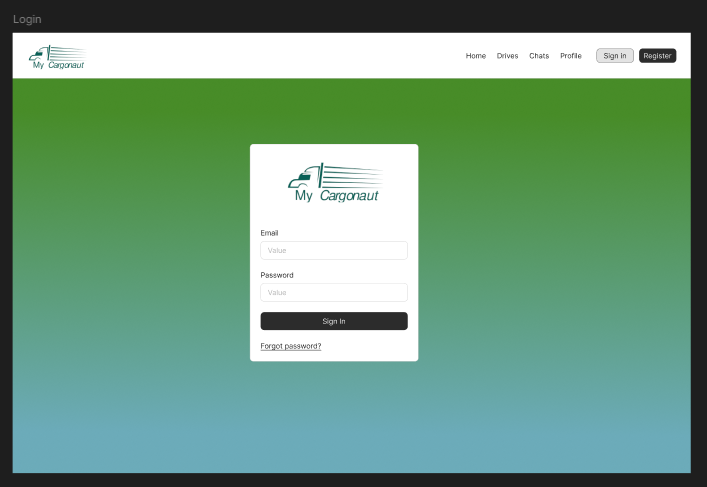
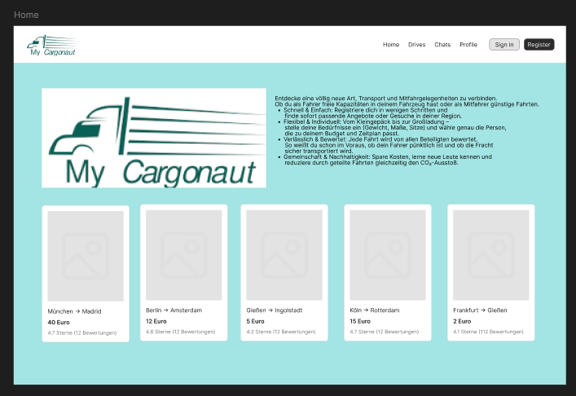
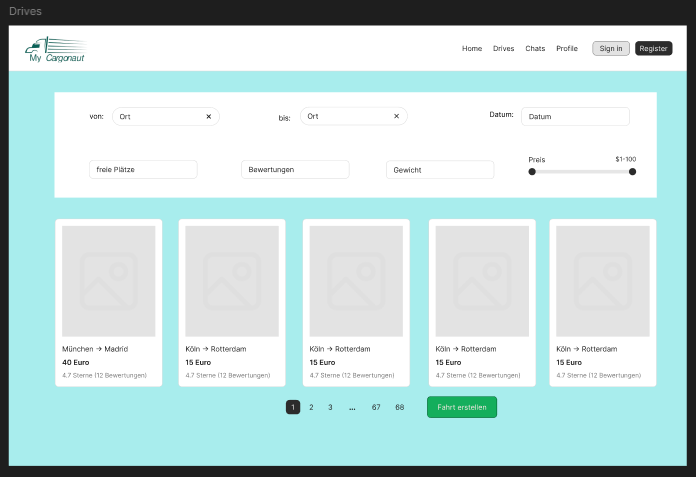
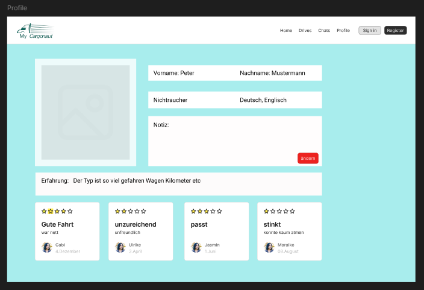
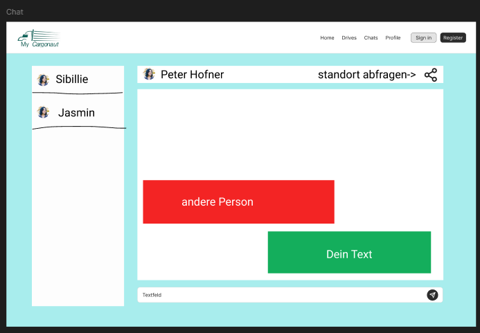
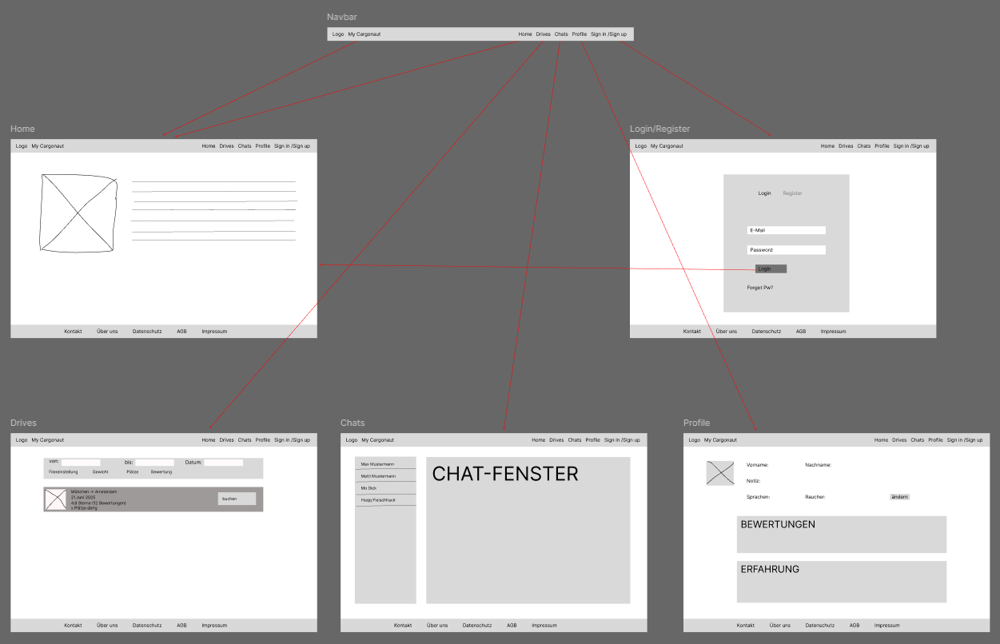

# MyCargonaut Frontend

This is the Frontend of the MyCargonaut Application. It is written in React, uses Tailwindcss/Shadcn for styling, i18next for internationalization and user notifications via react-hot-toast.

---

## Techstack

 - React - Frontend JS/TS library
 - i18next - Internationalization framework
 - Axios - Promise based HTTP client
 - react-host-toast - Toast notifications
 - Tailwindcss - CSS framework
 - shadcn/ui - UI components built with RadixUI and Tailwindcss

---

## Getting Started With The App

### Prerequisites

 - Node.js (version 18 or newer recommended)

### Installation

```bash
# Clone the repo
git clone git@github.com:Konzepte-moderner-Softwareentwicklung/Frontend.git
cd Frontend
cd frontendts

#Install dependencies
npm install
```

### Run the Application

If you want to run the backend and frontend locally start the backend first and then start the frontend:

```bash
npm run dev
```

this will start the frotend on port 5173, but locally use http://localhost only there the api endpoints will be available

# Internationalization

i18next is already configured for english and german. To add a language, add a new .json and add it to the config.tsx inside /src/i18next

# Notifications

You can trigger notifcations anywhere like this:
```js
import { toast } from "react-hot-toast";

toast.success('success text');
toast.error('error text');
```

# Styling via Tailwindcss and shadcn/ui

You can use Tailwind classes for layout and design
```bash
<div className="p-3 bg-amber-700 rounded-2xl"> Hello </div>
```

specific shadcn/ui components need to be installed first via npm
=>https://ui.shadcn.com/docs/installation/vite under add components.  
They can then be added like this:

```js
import { Button } from "@/components/ui/button"

<Button>Click here</Button>
```

# Project Structure

```bash
src/
    api/ # All the API Calls in one place
    assets/ # All the svg, png, and jpeg files
    components/ # components for modularity
    i18next/ # Internationalization files
    lib/ # honestly no idea
    pages/ # Every single page from the Mockups
    App.tsx
    types.tsx
```

# UML


# Mockup






# Wireframe


# Contributing
Pull requests are welcome, but need to be reviewed by one of the core team members, after the DoD are met.
If thats not the case a core member will point out what is missing. 

# Grober Klassenaufbau
.png)

## Definition of Done(DoD) – Requirements for New Contributions

All new contributions must meet the following criteria:

1. **Thorough Testing**  
   - Test all changes extensively before committing.

2. **Code Clarity**  
   - Add comments where the code is not self-explanatory.

3. **Error Logging**  
   - Ensure that errors are properly logged to support easier debugging.
   - Make sure the application is useable if an error occurs.

4. **Test Coverage**  
   - Write new tests for your code, or update existing ones as needed.

5. **Pipeline Stability**  
   - The CI/CD pipeline must run without errors.
